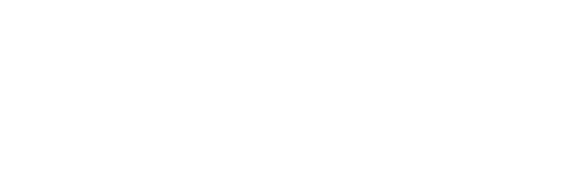
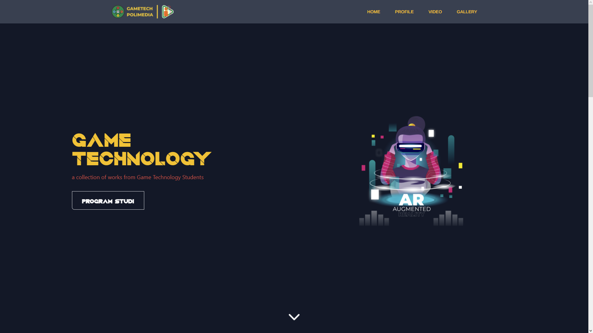
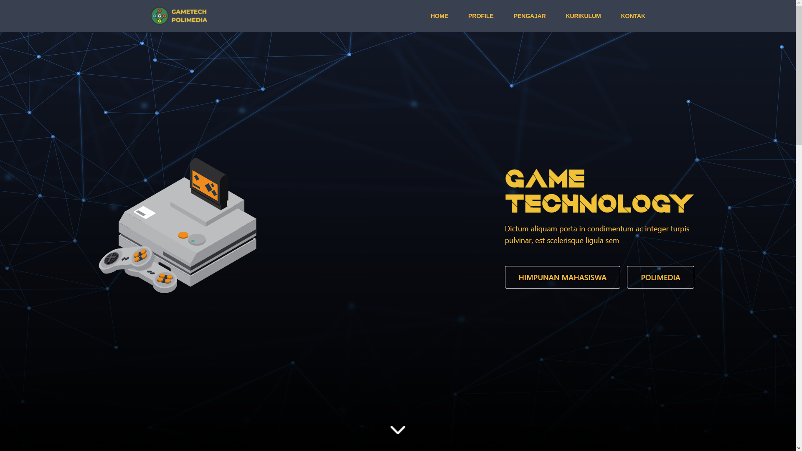
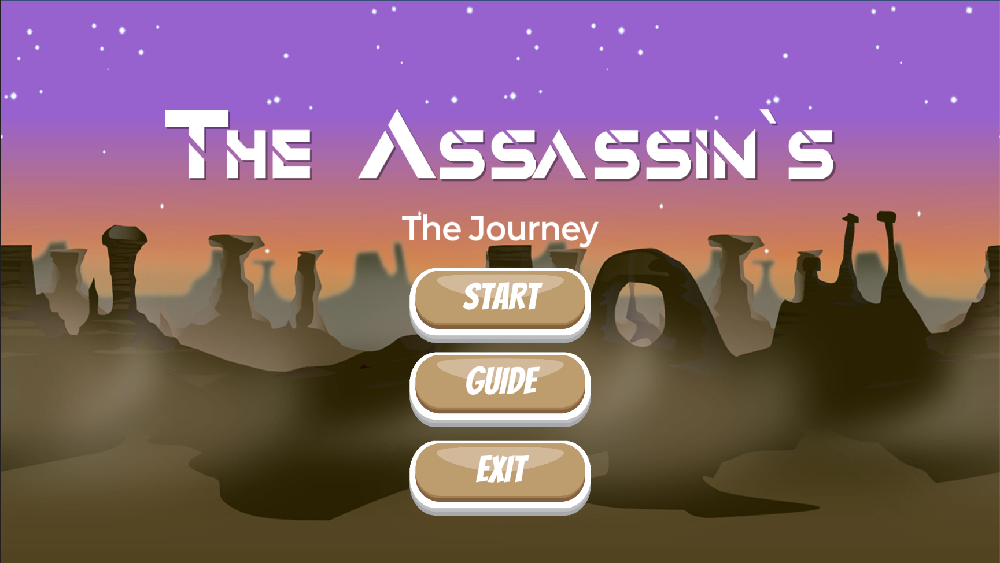
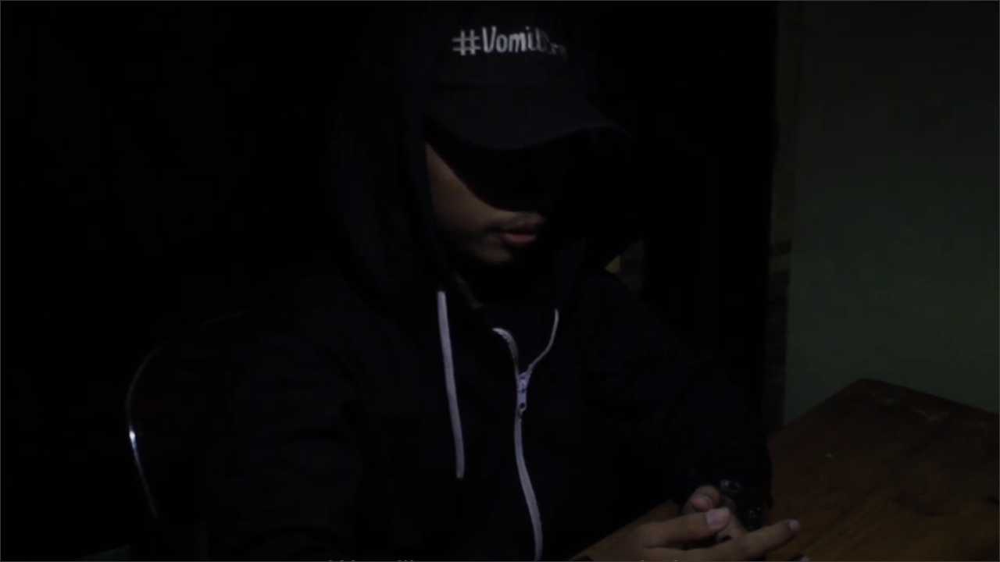
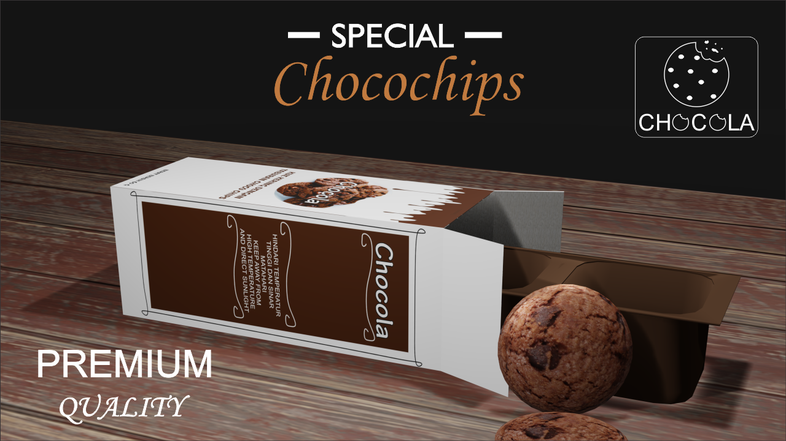
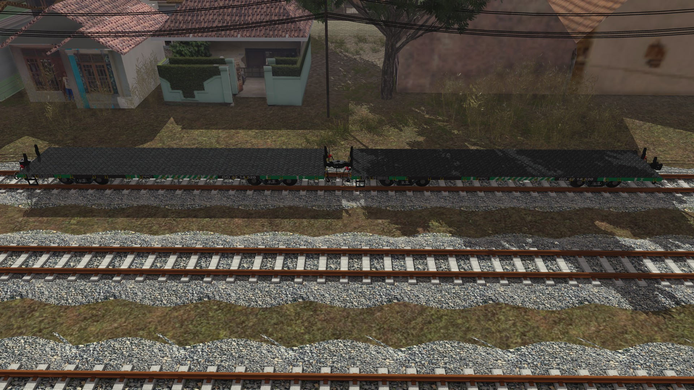

<html lang="en">

<head>
    <!-- Required meta tags -->
    <meta charset="utf-8">
    <meta name="viewport" content="width=device-width, initial-scale=1, shrink-to-fit=no">
    <!--  -->
    <link rel="stylesheet" href="style/tailwind.css">
    <link rel="stylesheet" href="https://cdnjs.cloudflare.com/ajax/libs/animate.css/4.1.1/animate.min.css" />
    <link rel="stylesheet" href="style/build.css">
    <link rel="icon" href="img/icon.png">
    <link rel="stylesheet" href="dist/aos.css" />
    
    
    <title>Haikal Danung Trinanda</title>

</head>

<body>

    <!-- Nav -->
    <header>
         
            

                

                    

                        
                        <button class="md:hidden rounded-lg focus:outline-none focus:shadow-outline"
                            @click="open = !open">
                            <svg fill="currentColor" viewBox="0 0 20 20" class="w-6 h-6">
                                <path x-show="!open" fill-rule="evenodd"
                                    d="M3 5a1 1 0 011-1h12a1 1 0 110 2H4a1 1 0 01-1-1zM3 10a1 1 0 011-1h12a1 1 0 110 2H4a1 1 0 01-1-1zM9 15a1 1 0 011-1h6a1 1 0 110 2h-6a1 1 0 01-1-1z"
                                    clip-rule="evenodd"></path>
                                <path x-show="open" fill-rule="evenodd"
                                    d="M4.293 4.293a1 1 0 011.414 0L10 8.586l4.293-4.293a1 1 0 111.414 1.414L11.414 10l4.293 4.293a1 1 0 01-1.414 1.414L10 11.414l-4.293 4.293a1 1 0 01-1.414-1.414L8.586 10 4.293 5.707a1 1 0 010-1.414z"
                                    clip-rule="evenodd"></path>
                            </svg>
                        </button>
                    

                    <nav :class="{'flex': open, 'hidden': !open}"
                        class="flex-col flex-grow pb-2 md:pb-0 hidden md:flex md:justify-end md:flex-row">

                        <a class="px-4 py-2 mt-2 text-lg font-semibold  rounded-lg  md:mt-0 hover:text-gray-900 focus:text-gray-900 hover:bg-gray-200 focus:bg-gray-200 focus:outline-none focus:shadow-outline"
                            href="index.html">Home</a>
                        <a class="px-4 py-2 mt-2 text-lg font-semibold bg-transparent rounded-lg  md:mt-0 md:ml-4 hover:text-gray-900 focus:text-gray-900 hover:bg-gray-200 focus:bg-gray-200 focus:outline-none focus:shadow-outline"
                            href="#profil">About Me</a>
                        <a class="px-4 py-2 mt-2 text-lg font-semibold bg-transparent rounded-lg  md:mt-0 md:ml-4 hover:text-gray-900 focus:text-gray-900 hover:bg-gray-200 focus:bg-gray-200 focus:outline-none focus:shadow-outline"
                            href="#kerjaan">My Work</a>
                        <a class="px-4 py-2 mt-2 text-lg font-semibold bg-transparent rounded-lg  md:mt-0 md:ml-4 hover:text-gray-900 focus:text-gray-900 hover:bg-gray-200 focus:bg-gray-200 focus:outline-none focus:shadow-outline"
                            href="#kontak">Contact</a>
                

            

        </nav>
    </header>

    <!-- Content -->
    <section class="h-full flex items-center pattern">
        

            

            

            

                <h1 class="text-5xl font-bold leading-none sm:text-6xl text-right text-white font4">HELLO THERE!</h1>
                <h1 class="text-5xl font-bold leading-none sm:text-4xl text-right text-white font4">NICE TO MEET YOU
                </h1>
                
I`M HAIKAL DANUNG TRINANDA
                      Indonesian Modder, Designer,
                    Game Developer, And Photographer
                

            

        

        
            
        
    </section>

    <!-- Profile  -->
    

        

            <h2
                class="max-w-lg mb-2 font-sans text-8xl font-bold tracking-tight text-white sm:text-6xl sm:leading-none font4 ">
                Who Am I?
            </h2>
            

                here you can recognize me
            

        

        

            

                

                    

                         
                        <h2
                            class="max-w-lg mb-3 font-sans text-3xl font-bold tracking-tight text-white sm:text-4xl sm:leading-none font4 ">
                            Do with desire.
                        </h2>
                        

                            Lorem ipsum dolor sit amet, consectetur adipiscing elit. Nulla aliquet scelerisque
                            fermentum.
                            Nulla nunc est, efficitur sed laoreet sed, fringilla vel velit. Praesent tempus
                            condimentum ligula eu efficitur.
                            Praesent consequat quam eget magna viverra ornare. Mauris sapien felis, convallis ut
                            eleifend sed, eleifend in odio.
                        

                    

                    

                        <a href="#"
                            class="px-8 py-3 text-lg font-semibold rounded-full shadow-2xl bg-green-600 hover:bg-white text-white hover:text-green-600">My
                            CV</a>
                        <a href="#"
                            class="px-8 py-3 text-lg font-semibold rounded-full shadow-2xl bg-yellow-600 hover:bg-white text-white hover:text-yellow-600">My
                            Resume</a>
                    

                

                

                    
                

            

        

    

    <!-- Divide -->
    

        

            

            

                   
            

        

    

    <!-- Gallery -->
    <section class=" grad text-white" id="kerjaan">
        

            

                <h2 class="text-5xl font-bold font4 animate__fadeInDown animate__animated">My Work</h2>
                
Here is the work I have done before, I hope
                    you enjoy it
 
            

            

                <article class="flex flex-col d">
                    
                    

                        
Game Technology Student
                            Association

                        <h3 class="flex-1 py-2 text-lg font-semibold leading-snug">FINISHED</h3>
                        

                            

                                Front End
                            

                            

                                UI/UX Design
                            

                        

                    

                </article>
                <article class="flex flex-col d">
                    
                    

                        
Game Technology Study Program

                        <h3 class="flex-1 py-2 text-lg font-semibold leading-snug">FINISHED</h3>
                        

                            

                                Front End
                            

                            

                                UI/UX Design
                            

                        

                    

                </article>
                <article class="flex flex-col d">
                    
                    

                        
The Assassin`s: The Journey

                        <h3 class="flex-1 py-2 text-lg font-semibold leading-snug">BETA TEST / DISCONTINUED</h3>
                        

                            

                                Back End
                            

                            

                                UI/UX Design
                            

                            

                                Game Designer
                            

                        

                    

                </article>
                <article class="flex flex-col d">
                    
                    

                        
Ngebook

                        <h3 class="flex-1 py-2 text-lg font-semibold leading-snug">FINISHED</h3>
                        

                            

                                Front End
                            

                            

                                UI/UX Design
                            

                        

                    

                </article>
            

            

                <article class="flex flex-col d">
                    
                    

                        
Kidnapper

                        <h3 class="flex-1 py-2 text-lg font-semibold leading-snug">FINISHED</h3>
                        

                            

                                DOP
                            

                            

                                Editor
                            

                            

                                Sound Design
                            

                        

                    

                </article>
                <article class="flex flex-col d">
                    
                    

                        
Chocola

                        <h3 class="flex-1 py-2 text-lg font-semibold leading-snug">FINISHED</h3>
                        

                            

                                Editor
                            

                            

                                DOP
                            

                            

                                Visual Effect Artist
                            

                            

                                Sound Design
                            

                        

                    

                </article>
                <article class="flex flex-col d">
                    
                    

                        
Trailer Game Technology Anniversary 1st

                        <h3 class="flex-1 py-2 text-lg font-semibold leading-snug">FINISHED</h3>
                        

                            

                                Editor
                            

                            

                                Sound Designer
                            

                            

                                Visual Effect Artist
                            

                        

                    

                </article>
               
                <article class="flex flex-col d">
                    
                    

                        
Game Technology Anniversary 1st

                        <h3 class="flex-1 py-2 text-lg font-semibold leading-snug">FINISHED</h3>
                        

                            

                                Operator
                            

                            

                                UI/UX Design
                            

                            

                                Switcher
                            

                        

                    

                </article>
            

            

                <article class="flex flex-col d">
                    
                    

                        
Flatcar by PT.Inka for Trainz Simulator

                        <h3 class="flex-1 py-2 text-lg font-semibold leading-snug">FINISHED</h3>
                        

                            

                                3D Model Artist
                            

                            

                                Animator
                            

                        

                    

                </article>
            

    </section>

    <!-- Footer -->
    <footer class="flex justify-center px-4 text-white grad1" id="kontak ">
        

            <h1 class="text-lg font-bold text-center lg:text-2xl font3">
                Interested in communicating with me?
            </h1>
            
Interested in working with me? Need help on your project?  Or just wanna say hi? I’d love to hear you about that.

            <h3 class="text-center font-bold font3">Hit me up on my social media :</h3>

            

            

                

                    

                        
                            
                            
                    

                

                

                    <a href="#"
                        class="text-xl font-bold text-white hover:text-gray-700 font2">He</a>
                

            

        

    </footer>
    <!--  -->
</body>

</html>
